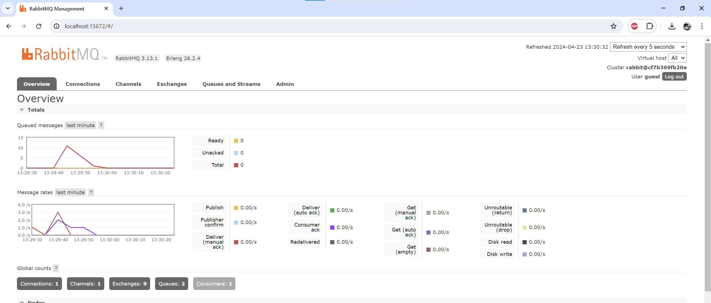
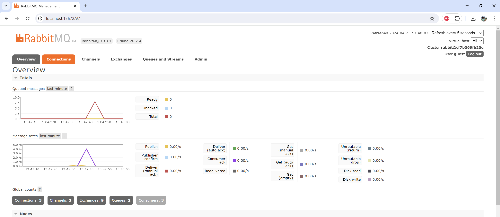

# Tutorial Modul 8 - Subscriber
---
### Muhammad Yusuf Haikal
### 2206081490
### Pemrograman Lanjut A
---

## 1. What is **amqp**?
AMQP (_Advanced Message Queueing Protocol_) merupakan protokol open-source untuk mengatur antrian pesan (message queuing) di antara aplikasi atau komponen perangkat lunak.

pada file `main.rs`, _AMQP_ digunakan untuk menerima pesan dari sebuah antrian (queue) dengan menggunakan library `crosstown_bus`. _AMQP_ digunakan sebagai mekanisme untuk menerima dan menangani pesan dari sebuah _queue_ `user_created`. Ketika ada pesan baru di antrian, _handler_ (`UserCreatedHandler`) akan dipanggil untuk memproses pesan tersebut.

## 2. What it means? `guest:guest@localhost:5672` , what is the first **guest**, and what is the second **guest**, and what is `localhost:5672` is for?
`guest` pertama pada kode tersebut merupakan username yang digunakan untuk mengakses server _AMQP_ _RabbitMQ_. 

`guest` kedua merupakan password dari username, yang dimana pada kode tersebut merupakan `guest`. 

`localhost:5672` merujuk pada tempat kode ini dijalankan,yaitu pada mesin lokal itu sendiri, yang mendengar pada port `5672`. 

Setelah simulasi slow subscriber. dapat dilihat bahwa umlah total queue sebanyak 10. Angka tersebut menggambarkan jumlah pesan yang belum tersampaikan kepada aplikasi subscriber.

Setelah membuat 3 terminal menjalankan subscriber, kemudian menjalankan publisher sebanyak 3 kali

Ketika menjalankan beberapa aplikasi subscriber (consumer) untuk satu antrian (queue) yang sama, jumlah pesan yang diterima oleh masing-masing subscriber akan lebih sedikit dibandingkan jika hanya ada satu subscriber saja. Ini karena RabbitMQ menggunakan strategi pembagian beban (load balancing) untuk mendistribusikan pesan antara subscriber yang tersedia.
Secara default, RabbitMQ menggunakan strategi round-robin untuk mendistribusikan pesan ke subscriber yang terhubung ke antrian yang sama. Ini berarti jika ada tiga subscriber terhubung ke antrian "user_created", maka setiap subscriber akan menerima sepertiga dari total pesan yang dikirimkan ke antrian tersebut.
Misalnya, jika publisher mengirimkan 15 pesan ke antrian "user_created" dan ada tiga subscriber yang terhubung, maka masing-masing subscriber akan menerima sekitar 5 pesan (asumsi pembagian merata).
Namun, jika hanya ada satu subscriber yang terhubung ke antrian, maka subscriber tersebut akan menerima semua pesan yang dikirimkan ke antrian.
Strategi pembagian beban ini dimaksudkan untuk membagi beban kerja antar subscriber dan meningkatkan throughput keseluruhan sistem. Dengan lebih banyak subscriber, setiap subscriber hanya perlu memproses sebagian dari pesan total, sehingga dapat mengurangi kemacetan dan meningkatkan kinerja sistem secara keseluruhan.